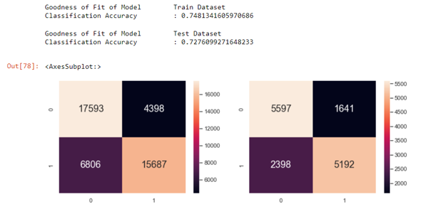

# CardioModel
Exploration of diffrent approaches (Naive-Bayes, Decision Tree, Random Forest) to predict the occurrence of cardiovascular disease.

## Description of Dataset
> 1. **Age** | Objective Feature | age | int (days)  
> 2. **Height** | Objective Feature | height | int (cm) |  
> 3. **Weight** | Objective Feature | weight | float (kg) |  
> 4. **Gender** | Objective Feature | gender | 1: women, 2: men |  
> 5. **Systolic blood pressure** | Examination Feature | ap_hi | int |  
> 6. **Diastolic blood pressure** | Examination Feature | ap_lo | int |  
> 7. **Cholesterol** | Examination Feature | cholesterol | 1: normal, 2: above normal, 3: well above normal |  
> 8. **Glucose** | Examination Feature | gluc | 1: normal, 2: above normal, 3: well above normal |  
> 9. **Smoking** | Subjective Feature | smoke | binary |  
> 10. **Alcohol intake** | Subjective Feature | alco | binary |  
> 11. **Physical activity** | Subjective Feature | active | binary |  
> 12. **Presence or absence** of cardiovascular disease | Target Variable | cardio | binary |

Learn more : https://www.kaggle.com/datasets/sulianova/cardiovascular-disease-dataset

